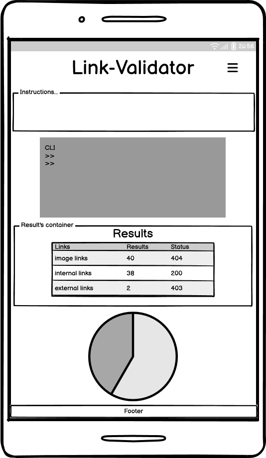

# [Web scraping project for link validation](https://link-validator-b9009544d013.herokuapp.com/)


## Introduction

The Link-Validator Tool is a Python application that allows users to scrape a webpage and validate all the links found within it. It performs checks for various link attributes, including URL validity, HTTP status codes, and the presence of Aria labels. The tool is especially useful for web developers, content managers, and SEO specialists who need to ensure the quality and integrity of hyperlinks on their websites.

## Table of Contents

1. [Introduction](#introduction)
2. [Technologies Used](#technologies-used)
   - [Python](#python)
   - [BeautifulSoup](#beautifulsoup)
   - [Requests](#requests)
   - [Google Sheets API](#google-sheets-api)
   - [URLParse Import](#urlparse-import)
   - [pandas](#pandas)
   - [tqdm](#tqdm)
   - [Colorama](#colorama)
   - [os](#os)
   - [webbrowser](#webbrowser)
3. [User Stories](#user-stories)
4. [Wireframe](#wireframe)
5. [Features](#features)
   - [Scraping and Validation](#scraping-and-validation)
   - [Google Sheets Integration](#google-sheets-integration)
   - [Interactive Command-Line Interface (CLI)](#interactive-command-line-interface-cli)
   - [Color-Coded Output](#color-coded-output)
   - [Error Handling](#error-handling)
   - [Progress Indicator](#progress-indicator)
   - [Reporting](#reporting)
   - [GitHub Integration](#github-integration)
6. [Troubleshooting](#troubleshooting)
   - [Handling Redirects](#handling-redirects)
   - [Invalid URL Handling](#invalid-url-handling)
   - [Inconsistent Link Status](#inconsistent-link-status)
7. [Testing](#testing)
   - [Validator Testing](#validator-testing)
     - [Python](#python)
   - [Manual Testing](#manual-testing)
     - [Acceptance Test](#acceptance-test)
     - [Testing with invalid URLs](#testing-with-invalid-urls)
     - [Testing with various types of links (internal, external, anchor links)](#testing-with-various-types-of-links-internal-external-anchor-links)
     - [Testing with URLs requiring authentication](#testing-with-urls-requiring-authentication)
     - [Testing the Google Sheets integration functionality](#testing-the-google-sheets-integration-functionality)
8. [Bugs](#bugs)
   - [Fixed Bugs](#fixed-bugs)
9. [UI Improvements](#ui-improvements)
10. [Future Improvements](#future-improvements)
11. [Setup](#setup)
    - [Prerequisites](#prerequisites)
    - [Installation](#installation)
    - [Usage](#usage)
12. [Deployment](#deployment)
    - [Cloning & Forking](#cloning--forking)
    - [Local Deployment](#local-deployment)
    - [Remote Deployment](#remote-deployment)
13. [Credits](#credits)
    - [Source Code](#source-code)
    - [Icons](#icons)
    - [Images](#images)
    - [Useful links](#useful-links)

## Technologies Used

- Python
- BeautifulSoup
- Requests
- Google Sheets API
- URLParse Import
- pandas
- tqdm
- colorama
- os
- webbrowser

### Python

- Python is a high-level programming language known for its simplicity and readability. It is widely used in web development, data analysis, artificial intelligence, and more. In the Link-Validator Tool, Python serves as the primary programming language for backend development.

- Example Usage:

  ```python
        import requests
        response = requests.get('https://example.com')
        print(response.status_code)
  ```

- Explanation:
  - In this example, Python's requests library is used to send an HTTP GET request to a URL (https://example.com).
  - The response object contains information about the HTTP response, including the status code.
  - The status_code attribute is accessed to print the status code of the response.

### BeautifulSoup

- BeautifulSoup is a Python library for parsing HTML and XML documents. It provides a simple interface for navigating and searching the parse tree, making it easy to extract data from web pages.

- Example Usage:

  ```python
     from bs4 import BeautifulSoup

     html_doc = """

     <html><head><title>Example</title></head>
     <body><p>Hello, world!</p></body></html>
     """
     soup = BeautifulSoup(html_doc, 'html.parser')
     print(soup.p.text)
  ```

- Explanation:
  - In this example, BeautifulSoup is used to parse an HTML document (html_doc) and create a parse tree.
  - The html.parser is used as the parser for parsing the HTML document.
  - The soup.p.text expression extracts the text content of the first <p> tag found in the HTML document.

### Requests

- Requests is an elegant and simple HTTP library for Python, allowing you to send HTTP requests easily. It is commonly used for interacting with web APIs and fetching web pages.

- Example Usage:

  ```python
  import requests

  response = requests.get('https://api.example.com/data')
  data = response.json()
  print(data)
  ```

- Explanation:
  - Here, the requests.get() function is used to send an HTTP GET request to the specified URL (https://api.example.com/data).
  - The json() method is called on the response object to deserialize the JSON response content into a Python dictionary.
  - Finally, the content of the response is printed, which typically represents data obtained from the API.

### Google Sheets API

- The Google Sheets API allows developers to read, write, and format data in Google Sheets. It enables integration with Google Sheets, enabling applications to update spreadsheet data programmatically.

- Example Usage:

  ```python
  import gspread
  from oauth2client.service_account import ServiceAccountCredentials

  # Define the scope and credentials

  scope = ['https://www.googleapis.com/auth/spreadsheets']
  creds = ServiceAccountCredentials.from_json_keyfile_name('credentials.json', scope)

  # Authorize the client

  client = gspread.authorize(creds)

  # Open a spreadsheet by its title

  sheet = client.open('Example Spreadsheet')

  # Select a worksheet

  worksheet = sheet.get_worksheet(0)

  # Update a cell

  worksheet.update_cell(1, 1, 'New Value')
  ```

- Explanation:
  - In this example, the Google Sheets API is used to interact with a Google Sheets spreadsheet.
  - ServiceAccountCredentials are used to authenticate the application using a service account and credentials stored in a JSON key file.
  - The gspread library is used to authorize the client and interact with the Google Sheets API.
  - A spreadsheet titled 'Example Spreadsheet' is opened, and a specific worksheet is selected.
  - The update_cell() method is used to update the value of a cell in the worksheet.

### URLParse Import

- The URLParse import provides functions for parsing URLs into their components and joining URL components to form absolute URLs.

- Example Usage:

  ```python
  from urllib.parse import urljoin, urlparse
  ```

- Explanation:

  - <b>urljoin</b>: Function for joining a base URL with another URL component to form an absolute URL.
  - <b>urlparse</b>: Function for parsing URLs into their components.

### pandas

- pandas is a powerful Python library for data manipulation and analysis. It provides data structures and functions designed to make working with structured data fast, easy, and expressive.

- Example Usage in the Code:

  ```python
  import pandas as pd

  # Reading a CSV file into a pandas DataFrame
  df = pd.read_csv('data.csv')

  # Performing operations on the DataFrame
  df_filtered = df[df['column'] > 10]

  # Writing the modified DataFrame back to a CSV file
  df_filtered.to_csv('filtered_data.csv', index=False)
  ```

- Explanation:
  - In this example, pandas is imported as pd for convenience.
  - The read_csv() function is used to read data from a CSV file into a pandas DataFrame.
  - Various operations, such as filtering rows based on a condition, can be performed on the DataFrame.
  - The modified DataFrame can be written back to a CSV file using the to_csv() function.

### tqdm

- tqdm is a Python library that provides a fast, extensible progress bar for loops and other iterative processes. It offers a simple way to visualize the progress of tasks, making it easier to monitor long-running operations.

- Example Usage in the Code:

  ```python
  from tqdm import tqdm

  # Iterating over a range with tqdm
  for i in tqdm(range(100)):
      # Perform some task here
      pass

  ```

- Explanation:
  - In this example, tqdm is imported to visualize the progress of a loop.
  - The tqdm() function wraps the iterable (in this case, range(100)) and displays a progress bar as the loop iterates.
  - Inside the loop, tasks are performed, and tqdm updates the progress bar accordingly.

### Colorama

- colorama is a Python library that makes it easy to add ANSI colors and styles to terminal output. It provides cross-platform support for colored text, allowing developers to create visually appealing command-line interfaces.

- Example Usage in the Code:

  ```python
  import colorama
  from colorama import Fore, Back, Style

  # Initialize colorama
  colorama.init()

  # Print colored text
  print(Fore.RED + 'Error: Something went wrong!' + Style.RESET_ALL)
  ```

- Explanation:
  - In this example, colorama is imported to add color to terminal output.
  - The init() function is called to initialize colorama and set up the necessary environment variables.
  - ANSI color codes from colorama's Fore and Style modules are used to change the text color.
  - Style.RESET_ALL is used to reset the text color to the default after printing.

### os

- The os module in Python provides a way to interact with the operating system. It offers functions for performing tasks such as file operations, directory manipulation, and process management.

- Example Usage in the Code:

  ```python
  import os

  # Get the current working directory
  cwd = os.getcwd()
  print('Current directory:', cwd)

  # List files in a directory
  files = os.listdir(cwd)
  print('Files in current directory:', files)
  ```

- Explanation:
  - In this example, os is imported to perform operating system-related tasks.
  - The getcwd() function is used to get the current working directory.
  - listdir() is used to list the files in the current working directory.

### webbrowser

- The webbrowser module in Python provides a high-level interface for displaying web-based documents to users. It allows Python scripts to open web browsers and display web pages, URLs, and HTML documents.

- Example Usage in the Code:

  ```python
  import webbrowser

  # Open a web page in the default browser
  webbrowser.open('https://example.com')

  # Open a specific browser with a URL
  webbrowser.get('firefox').open_new_tab('https://example.com')
  ```

- Explanation:

  - In this example, webbrowser is imported to interact with web browsers.
  - The open() function opens the specified URL in the default web browser.
  - get() allows selecting a specific browser (e.g., Firefox) and opening a URL in a new tab using open_new_tab().

## User stories

| As a user...                                                                                                                             | I know I'm done when...                                   |
| ---------------------------------------------------------------------------------------------------------------------------------------- | --------------------------------------------------------- |
| I want to be able to input a URL so that I can validate its links.                                                                       | I see a prompt or interface to enter the URL              |
| I want to receive a list of all links found on the provided URL so that I can review them.                                               | I see a list of links displayed                           |
| I want to see the status of each link (valid or broken) so that I can assess the health of the website.                                  | I see each link marked as valid or broken                 |
| I want the tool to handle different types of links (internal, external, anchor links) so that I can validate any type of URL.            | I can validate internal, external, and anchor links       |
| I want the tool to handle redirects and follow them to the final destination so that I can accurately determine the status of each link. | I see the final destination status of each link           |
| I want to see a progress indicator while the tool is scanning the webpage so that I know it's working.                                   | I see a visual indicator or message showing progress      |
| I want the tool to provide detailed error messages for broken links so that I can understand why they failed.                            | I receive clear messages explaining why links failed      |
| I want the tool to be easy to use with a simple command-line interface so that I can quickly validate URLs without any hassle.           | I can easily run the tool from the command line           |
| I want the tool to generate a report summarizing the results of the link validation process so that I can easily share it with others.   | I receive a summary report of the link validation process |

## Wireframe

- TODO - Add flow chart instead of wireframes
  

## Features

- TODO - ADD screenshots

### Scraping and Validation

- Scrapes a webpage and validates all links found, checking for broken links, missing Aria labels, and more.

### Google Sheets Integration

- Stores link validation results in a Google Sheets document for easy access and sharing.

### Interactive Command-Line Interface (CLI)

- Provides a user-friendly CLI with menu options for different operations and displays results in real-time.

### Color-Coded Output

- Utilizes color-coded output for easy identification of link status (valid, invalid, etc.).

### Error Handling

- Implements robust error handling to handle various scenarios gracefully.

### Progress Indicator

- Displays a progress indicator during the link validation process to indicate the status of the operation.

### Reporting

- Generates a comprehensive report summarizing the results of the link validation process, including statistics and detailed information about broken links.

### GitHub Integration

- Provides a direct link to the project's GitHub repository for additional information and contributions.

## Troubleshooting

- Encountered issues and how they were resolved during the development of the Link-Validator Tool.

### Handling Redirects

- Issue: The tool was not following redirects properly, leading to inaccurate link status validation. When a URL redirects to another URL, the tool wasn't able to capture the final destination URL and status code.
- Resolution: Updated the HTTP request handling code to automatically follow redirects and obtain the final destination URL and status code.

```python
# Inside the 'scrape_and_validate_links' method
try:
    response = requests.get(url)
    response.raise_for_status()  # Raise an HTTPError if status code is not 200
    soup = BeautifulSoup(response.content, "html.parser")
except requests.exceptions.RequestException as e:
    print(self.RED + f"An error occurred while fetching the webpage: {e}" + self.RESET)
    return
```

- Explanation: The code snippet above uses the requests.get() method to send an HTTP GET request to the URL and automatically follow redirects. The raise_for_status() method is called to raise an HTTPError if the status code of the response is not 200 (OK). This ensures that the tool captures the final destination URL and status code accurately.

### Invalid URL Handling

- Issue: The tool may encounter invalid URLs entered by the user, causing the program to crash.
- Resolution: Implemented URL validation to ensure that only valid URLs are accepted, and added handling for invalid URLs.

```python
# Inside the 'validate_url' method
try:
    response = requests.head(url, allow_redirects=True, stream=True, timeout=5)
    print(self.GREEN + "Status code: " + str(response.status_code) + self.RESET)
    return response.status_code == 200
except requests.exceptions.RequestException as e:
    print(Back.RED + f"Error: {e}" + self.RESET)
    return False
except ValueError as e:
    print(f"Invalid URL: {e}")
    return False
```

- Explanation: The code snippet above uses the requests.head() method to send a HEAD request to the URL and check the status code of the response. If the URL is invalid or the request fails, an exception is caught, and an appropriate error message is displayed.

### Inconsistent Link Status

- Issue: The tool was not consistently determining the status of links, leading to inaccuracies in link validation.
- Resolution: Added logic to check the status code of the HTTP response and classify links as either valid or broken based on the status code.

```python
# Inside the 'check_broken_links' method
if response.status_code >= 400:
    print(f"Broken link found: {link}")
    link_status[link] = ('broken', response.status_code)
else:
    link_status[link] = ('valid', response.status_code)
```

- Explanation: The code snippet above checks the status code of the HTTP response and classifies links as either valid or broken based on the status code. If the status code is greater than or equal to 400, the link is considered broken, and the status code is stored in the link_status dictionary.

## Testing

### Manual Testing

#### Acceptance Test

| Test Scenario                                              | Test Steps                                                                                                                                                                 | Expected Result                                                                                                                            |
| ---------------------------------------------------------- | -------------------------------------------------------------------------------------------------------------------------------------------------------------------------- | ------------------------------------------------------------------------------------------------------------------------------------------ |
| User inputs a valid URL and initiates link validation      | 1. Open the command-line interface (CLI).<br> 2. Run the Link-Validator Tool by executing the appropriate command (python run.py).<br> 3. Enter a valid URL when prompted. | The Link-Validator Tool successfully scrapes the webpage, validates all links, and generates a comprehensive report with accurate results. |
| User inputs an invalid URL and attempts to validate links  | Enter an invalid URL when prompted.                                                                                                                                        | The Link-Validator Tool detects the invalid URL and displays an error message indicating the issue.                                        |
| User validates a webpage containing various types of links | Enter a URL with internal, external, and anchor links when prompted.                                                                                                       | The Link-Validator Tool successfully validates internal, external, and anchor links found on the webpage.                                  |
| User validates a webpage that requires authentication      | Enter a URL that requires authentication when prompted.                                                                                                                    | The Link-Validator Tool successfully validates links on webpages that require authentication, ensuring accurate results.                   |
| User tests Google Sheets integration functionality         | Enter a URL to validate and choose to save results to Google Sheets.                                                                                                       | The Link-Validator Tool integrates with Google Sheets and saves the link validation results for easy access and sharing.                   |
| User tests color-coded output feature                      | Enter a URL to validate and observe the color-coded output.                                                                                                                | The Link-Validator Tool displays link validation results using color-coded output for easy identification and interpretation.              |
| User tests error handling mechanism                        | Enter a URL that triggers an error during validation.                                                                                                                      | The Link-Validator Tool handles errors during the validation process and displays clear error messages to guide users.                     |
| User tests trailing slashes in URLs                        | Enter a URL with a trailing slash when prompted.                                                                                                                           | The Link-Validator Tool accurately validates links on webpages with trailing slashes in the URL.                                           |
| User tests progress indicator feature                      | Enter a URL to validate and observe the progress indicator.                                                                                                                | The Link-Validator Tool provides a progress indicator to inform users about the status of the validation process.                          |
| User tests reporting functionality                         | Enter a URL to validate and choose to generate a report.                                                                                                                   | The Link-Validator Tool creates a comprehensive report summarizing the link validation results.                                            |
| User tests GitHub integration feature                      | Choose the option to view the GitHub repository.                                                                                                                           | The Link-Validator Tool integrates with GitHub and provides users with a direct link to the project repository for additional information. |
| User chooses to display all links scraped from webpage     | Select the option to display all links scraped from the last webpage.                                                                                                      | The Link-Validator Tool displays all links scraped from the last webpage.                                                                  |
| User chooses to view links with connection errors          | Select the option to view links with connection errors.                                                                                                                    | The Link-Validator Tool displays links that were not verified due to connection errors.                                                    |
| User chooses to display links with missing Aria labels     | Select the option to display links with missing Aria labels.                                                                                                               | The Link-Validator Tool displays links with missing Aria labels.                                                                           |
| User chooses to view broken links                          | Select the option to view broken links.                                                                                                                                    | The Link-Validator Tool displays broken links found during validation.                                                                     |
| User chooses to view a summary of findings                 | Select the option to view a summary of findings.                                                                                                                           | The Link-Validator Tool displays a summary of the link validation findings.                                                                |
| User chooses to empty the Google Sheet                     | Select the option to empty the Google Sheet.                                                                                                                               | The Link-Validator Tool clears all data stored in the Google Sheet.                                                                        |
| User chooses to open the Google Sheets                     | Select the option to open the Google Sheets.                                                                                                                               | The Link-Validator Tool opens the Google Sheets for viewing and management.                                                                |
| User chooses to view the source code on GitHub             | Select the option to view the source code on GitHub.                                                                                                                       | The Link-Validator Tool opens the GitHub repository in the default web browser for users to explore the source code.                       |

#### Application Start-Up Tests

| Test Number | Test                      | Test Data              | Expected Result                                                                             | Actual Result                                                                                     | Test Result |
| ----------- | ------------------------- | ---------------------- | ------------------------------------------------------------------------------------------- | ------------------------------------------------------------------------------------------------- | ----------- |
| 1           | Check Internet Connection | Internet connection    | Displays a colorful welcome message and menu options if an internet connection is available | Colorful welcome message displayed along with menu options if an internet connection is available | Pass        |
| 2           | Check Internet Connection | No internet connection | Program terminates with a connection error message                                          | Program terminated with a connection error message                                                | Pass        |

#### Main menu

| Test Number | Test                                 | Test Data              | Expected Result                                          | Actual Result                                          | Test Result |
| ----------- | ------------------------------------ | ---------------------- | -------------------------------------------------------- | ------------------------------------------------------ | ----------- |
| 1           | Main Menu Validation                 | Input " "              | Error message                                            | Error message displayed                                | Pass        |
| 2           | Main Menu Validation                 | Input "a"              | Error message                                            | Error message displayed                                | Pass        |
| 3           | Main Menu Validation                 | Input 20               | Error message                                            | Error message displayed                                | Pass        |
| 4           | Main Menu Validation                 | Input "$"              | Error message                                            | Error message displayed                                | Pass        |
| 5           | Main Menu Validation                 | Input 0                | Exits the program                                        | Program exited successfully                            | Pass        |
| 6           | Main Menu Validation                 | Input 1-9              | Displays the corresponding functionality menu            | Correct menu displayed for the entered option          | Pass        |
| 7           | Main Menu Validation                 | Input other characters | Error message                                            | Error message displayed                                | Pass        |
| 8           | Program termination by user (Ctrl+C) | Ctrl+C                 | Program terminates gracefully with a termination message | Program terminated gracefully with termination message | Pass        |

#### Option 1 - Scrape and Validate Links
| Test Number | Test                                 | Test Data              | Expected Result                                          | Actual Result                                          | Test Result |
| ----------- | ------------------------------------ | ---------------------- | -------------------------------------------------------- | ------------------------------------------------------ | ----------- |

#### Option 2 - Display All Links Scraped
| Test Number | Test                                 | Test Data              | Expected Result                                          | Actual Result                                          | Test Result |
| ----------- | ------------------------------------ | ---------------------- | -------------------------------------------------------- | ------------------------------------------------------ | ----------- |

#### Option 3 - Display Links not Verified due to Connection Errors
| Test Number | Test                                 | Test Data              | Expected Result                                          | Actual Result                                          | Test Result |
| ----------- | ------------------------------------ | ---------------------- | -------------------------------------------------------- | ------------------------------------------------------ | ----------- |

#### Option 4 - Display Links with Missing Aria Labels
| Test Number | Test                                 | Test Data              | Expected Result                                          | Actual Result                                          | Test Result |
| ----------- | ------------------------------------ | ---------------------- | -------------------------------------------------------- | ------------------------------------------------------ | ----------- |

#### Option 5 - Display Broken Links
| Test Number | Test                                 | Test Data              | Expected Result                                          | Actual Result                                          | Test Result |
| ----------- | ------------------------------------ | ---------------------- | -------------------------------------------------------- | ------------------------------------------------------ | ----------- |

#### Option 6 - Display a Summary of Findings
| Test Number | Test                                 | Test Data              | Expected Result                                          | Actual Result                                          | Test Result |
| ----------- | ------------------------------------ | ---------------------- | -------------------------------------------------------- | ------------------------------------------------------ | ----------- |

#### Option 7 - Empty the Links Google Sheet
| Test Number | Test                                 | Test Data              | Expected Result                                          | Actual Result                                          | Test Result |
| ----------- | ------------------------------------ | ---------------------- | -------------------------------------------------------- | ------------------------------------------------------ | ----------- |

#### Option 8 - Open Google Sheets
| Test Number | Test                                 | Test Data              | Expected Result                                          | Actual Result                                          | Test Result |
| ----------- | ------------------------------------ | ---------------------- | -------------------------------------------------------- | ------------------------------------------------------ | ----------- |

#### Option 9 - Open GitHub
| Test Number | Test                                 | Test Data              | Expected Result                                          | Actual Result                                          | Test Result |
| ----------- | ------------------------------------ | ---------------------- | -------------------------------------------------------- | ------------------------------------------------------ | ----------- |


### Validator Testing

- The Link-Validator Tool was tested using the following validation methods:

#### Python test

- Flake8 was used to check the code for PEP8 compliance and to identify any potential issues or inconsistencies in the codebase.

  ```properties
  flake8 run.py
  ```

  - The Flake8 tool was used to check the code for PEP8 compliance and identify any potential issues or inconsistencies in the codebase. The output of the Flake8 command provides information about the specific lines of code that need to be addressed to ensure PEP8 compliance.

  - TODO - Add the output of the Flake8 command and any necessary corrections made to the code.

## Bugs

- TODO

### Fixed Bugs

- Explain the bugs encountered during the development of the Link-Validator Tool and how they were resolved.

### Trail slash in the URL

- Issue: The tool was not handling URLs with trailing slashes correctly, leading to inaccurate link validation results.

#### Incorrect Identification of Internal Links

- Issue: The tool was incorrectly saving internal links with the wrong base URL, leading to inaccurate validation results.

## UI Improvements

- TODO
- TODO - Implementation of the colorama library
- TODO - Implementation of the Asci art
- TODO - Improve Main Menu

## Futures Improvements

- **Improved Link Validation Algorithm**: Enhance the link validation algorithm to handle edge cases more effectively and accurately detect various types of broken links.
- **Enhanced User Interface**: Develop a graphical user interface (GUI) using a framework like PyQt or Tkinter to provide a more intuitive and visually appealing experience for users.
- **Parallel Processing**: Implement parallel processing techniques to speed up the link validation process, allowing the tool to handle large websites more efficiently.
- **Customizable Reporting**: Allow users to customize the format and content of the link validation report, including options to export data in different formats (e.g., CSV, PDF).
- **Integration with More External Services**: Integrate with additional external services and APIs to enhance functionality, such as integration with popular CMS platforms or SEO analysis tools.
- **Scheduled Scans**: Add support for scheduled scans or automated monitoring of websites, enabling users to receive regular reports on the status of their links.
- **Browser Extension**: Develop a browser extension that users can install to perform link validation directly within their web browsers, simplifying the validation process.
- **Advanced Configuration Options**: Provide advanced configuration options for users to customize the link validation process, such as specifying timeout values or configuring custom headers for requests.
- **Error Handling Enhancements**: Improve error handling mechanisms to gracefully handle unexpected errors and provide more informative error messages to users.
- **Internationalization (i18n)**: Implement support for multiple languages to make the tool accessible to users from different regions and language preferences.

## Setup

- If you want to deploy the Link-Validator Tool locally for testing or development purposes, follow these steps:

### Prerequisites

Before running the Link-Validator Tool, ensure you have the following installed:

- Python 3.x
- pip package manager
- Google Account (for Google Sheets integration)

### Installation

1. Clone the repository to your local machine:

   ```properties
   git clone https://github.com/yourusername/link-validator.git
   ```

2. Navigate to the project directory:

   ```properties
   cd link-validator
   ```

3. Install the required Python packages:

   ```properties
   pip install -r requirements.txt
   ```

4. Obtain Google Sheets API credentials:
   - Visit the [Google Developers Console](https://console.developers.google.com/).
   - Create a new project.
   - Enable the Google Sheets API for your project.
   - Create service account credentials and download the JSON file.
   - Rename the JSON file to `creds.json` and place it in the project directory.

### Usage

To run the Link-Validator Tool, execute the following command in your terminal:

```properties
python run.py
```

## Deployment

- Deploying the Link-Validator Tool locally or remotely using Heroku.

### Cloning & Forking

- To clone or fork the Link-Validator Tool repository, follow the instructions below:

#### Cloning

- To clone this repository to your local machine, use the following command:

  ```properties
  git clone https://github.com/yourusername/link-validator.git
  ```

#### Forking

1. Visit [Link-Validator Tool](github.com/jeffdruid/link-validator)
2. Click on the "Fork" button located in the top-right corner of the page.
3. Optionally, you can provide a description for your fork.
4. Select "Create fork". You will be redirected to your newly created forked repository.

### Local Deployment

- To deploy this project locally, follow the installation instructions provided in the Setup section.

### Remote Deployment (Heroku)

1. Create a Heroku Account
   If you haven't already, sign up for a free account on [Heroku](https://signup.heroku.com/)

2. Install Heroku CLI
   Download and install the Heroku CLI for your operating system.

3. Login to Heroku
   Open a terminal or command prompt and login to your Heroku account using the following command:

```properties
heroku login
```

Follow the prompts to enter your Heroku credentials.

4. Prepare Your Application
   Ensure your application is ready for deployment to Heroku:

- Make sure your application has a requirements.txt file listing all dependencies.
- Include a Procfile in the root directory of your project. This file specifies the commands that Heroku should use to run your application.
- If your application requires any environment variables, ensure they are properly configured.

5. Initialize Git Repository

- If your project is not already a Git repository, initialize one:

```properties
git init
git add .
git commit -m "Initial commit"
```

6. Create a Heroku App
   Create a new Heroku app using the Heroku CLI:

```properties
heroku create your-app-name
```

Replace your-app-name with a unique name for your Heroku app.

7. Deploy Your Application
   Deploy your application to Heroku using Git:

```properties
git push heroku main
```

Replace main with the name of your main branch if it's different (e.g., master).

8. Open Your Application
   Once the deployment is complete, you can open your application in the browser using the following command:

```properties
heroku open
```

- This will open your application in the default web browser.
- Your Python application should now be deployed and running on Heroku. You can access it using the provided Heroku URL or custom domain if configured.

## Credits

- TODO
- [Code Institute - Terminal](https://codeinstitute.net/)
- [Heroku - Cloud Application Platform](https://www.heroku.com/)
- [BeautifulSoup Documentation](https://www.crummy.com/software/BeautifulSoup/bs4/doc/)
- [Requests Documentation](https://docs.python-requests.org/en/master/)
- [Google Sheets API Documentation](https://developers.google.com/sheets/api)
- [URLParse Documentation](https://docs.python.org/3/library/urllib.parse.html)
- [pandas Documentation](https://pandas.pydata.org/docs/)
- [tqdm Documentation](https://tqdm.github.io/)
- [Colorama Documentation](https://pypi.org/project/colorama/)
- [os Documentation](https://docs.python.org/3/library/os.html)
- [webbrowser Documentation](https://docs.python.org/3/library/webbrowser.html)
- [Asci Art Generator](https://patorjk.com/software/taag/)
- [Black - The Uncompromising Code Formatter](https://black.readthedocs.io/en/stable/)
- [flake8 - Your Tool For Style Guide Enforcement](https://flake8.pycqa.org/en/latest/)

### Source Code

- [Link-Test Github](https://github.com/jeffdruid/link-test)

#### Images

- [Banner - Canva AI](https://www.canva.com)

#### Useful links

- TODO
- [Link-Test Page](https://jeffdruid.github.io/link-test/)
- [Web Scraping with Python and BeautifulSoup is THIS easy! - Tom's Tech Academy](https://www.youtube.com/watch?v=nBzrMw8hkmY)
- [The Best Websites to Practice Your Web Scraping Skills in 2024 - Proxyway](https://proxyway.com/guides/best-websites-to-practice-your-web-scraping-skills)
- [Web Scraping with Python and BeautifulSoup - Real Python](https://realpython.com/beautiful-soup-web-scraper-python/)
- [Web Scraping with Python: A Beginner's Guide - DataCamp](https://www.datacamp.com/community/tutorials/web-scraping-using-python)
- [freeCodeCamp.org - Web Scraping with Python](https://www.freecodecamp.org/news/web-scraping-python-tutorial-how-to-scrape-data-from-a-website/)
- [Learn python - Full Course for Beginners - freeCodeCamp.org](https://www.youtube.com/watch?v=rfscVS0vtbw)
- [Stack Overflow - Max line length in Python](https://stackoverflow.com/questions/39973318/what-is-the-maximum-length-of-a-line-in-python)

## License

- The Link-Validator Tool is licensed under the MIT License.
