# [Link-Validator Tool](https://link-validator-b9009544d013.herokuapp.com/)


## Introduction

The Link-Validator Tool is a Python application that allows users to scrape a webpage and validate all the links found within it. It performs checks for various link attributes, including URL validity, HTTP status codes, and the presence of Aria labels. The tool is especially useful for web developers, content managers, and SEO specialists who need to ensure the quality and integrity of hyperlinks on their websites.
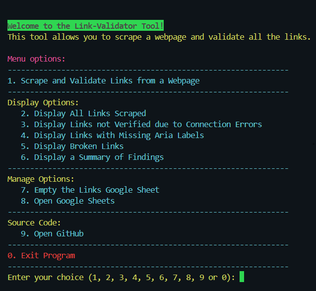

## Table of Contents

1. [Introduction](#introduction)
2. [Technologies Used](#technologies-used)

   - [Python](#python)
   - [BeautifulSoup](#beautifulsoup)
   - [Requests](#requests)
   - [Google Sheets API](#google-sheets-api)
   - [URLParse Import](#urlparse-import)
   - [pandas](#pandas)
   - [tqdm](#tqdm)
   - [Colorama](#colorama)
   - [os](#os)
   - [webbrowser](#webbrowser)

3. [User Stories](#user-stories)
4. [Flowchart](#flowchart)
5. [Features](#features)
   - [Scraping and Validation](#scraping-and-validation)
   - [Google Sheets Integration](#google-sheets-integration)
   - [Interactive Command-Line Interface (CLI)](#interactive-command-line-interface-cli)
   - [Color-Coded Output](#color-coded-output)
   - [Error Handling](#error-handling)
   - [Progress Indicator](#progress-indicator)
   - [Reporting](#reporting)
   - [GitHub Integration](#github-integration)
6. [Troubleshooting](#troubleshooting)
   - [Handling Redirects](#handling-redirects)
   - [Invalid URL Handling](#invalid-url-handling)
   - [Inconsistent Link Status](#inconsistent-link-status)
7. [Testing](#testing)
   - [Validator Testing](#validator-testing)
     - [flake8](#flake8)
     - [CI Python Linter](#ci-python-linter)
   - [Manual Testing](#manual-testing)
8. [Bugs](#bugs)
   - [Google Sheets Not Opening in a New Tab (Deployment Issue)](#google-sheets-not-opening-in-a-new-tab-deployment-issue)
   - [GitHub Repository Link Not Opening in a New Tab (Deployment Issue)](#github-repository-link-not-opening-in-a-new-tab-deployment-issue)
   - [Fixed Bugs](#fixed-bugs)
     - [Trail slash in the URL](#trail-slash-in-the-url)
     - [Incorrect Identification of Internal Links](#incorrect-identification-of-internal-links)
     - [Incorrect Base URL Extraction](#incorrect-base-url-extraction)
9. [UI Improvements](#ui-improvements)
   - [Implementation of the colorama Library](#implementation-of-the-colorama-library)
   - [Removal of ASCII Art](#removal-of-ascii-art)
   - [Improved Main Menu](#improved-main-menu)
   - [Adjusted display all links according to terminal size](#adjusted-display-all-links-according-to-terminal-size)
10. [Future Improvements](#futures-improvements)
11. [Setup](#setup)
    - [Prerequisites](#prerequisites)
    - [Installation](#installation)
    - [Usage](#usage)
12. [Deployment](#deployment)
    - [Cloning & Forking](#cloning--forking)
    - [Local Deployment](#local-deployment)
    - [Remote Deployment (Heroku)](#remote-deployment-heroku)
13. [Credits](#credits)
    - [Source Code](#source-code)
    - [Images](#images)
    - [Useful links](#useful-links)
14. [License](#license)

## Technologies Used

- Python
- BeautifulSoup
- Requests
- Google Sheets API
- URLParse Import
- pandas
- tqdm
- colorama
- os
- webbrowser

### Python

- Python is a high-level programming language known for its simplicity and readability. It is widely used in web development, data analysis, artificial intelligence, and more. In the Link-Validator Tool, Python serves as the primary programming language for backend development.

- Example Usage:

  ```python
        import requests
        response = requests.get('https://example.com')
        print(response.status_code)
  ```

- Explanation:
  - In this example, Python's requests library is used to send an HTTP GET request to a URL (https://example.com).
  - The response object contains information about the HTTP response, including the status code.
  - The status_code attribute is accessed to print the status code of the response.

### BeautifulSoup

- BeautifulSoup is a Python library for parsing HTML and XML documents. It provides a simple interface for navigating and searching the parse tree, making it easy to extract data from web pages.

- Example Usage:

  ```python
  from bs4 import BeautifulSoup

    def scrape_and_validate_links(self, url):
        """
        Scrape the webpage content using BeautifulSoup.
        """
        try:
            # Fetch webpage content
            response = requests.get(url)
            soup = BeautifulSoup(response.text, 'html.parser')

            # Extract all links from the webpage
            links = soup.find_all('a', href=True)
  ```

- Explanation:
  - In this example, BeautifulSoup is used to parse the HTML content of a webpage.
  - The scrape_and_validate_links method takes a URL as input and attempts to fetch the webpage content using the requests library.
  - If the webpage is successfully fetched, BeautifulSoup is used to parse the HTML content (response.text) and create a parse tree (soup).
  - The find_all method is then used to find all `<a>` (anchor) tags with an href attribute, which represent links on the webpage.

### Requests

- Requests is an elegant and simple HTTP library for Python, allowing you to send HTTP requests easily. It is commonly used for interacting with web APIs and fetching web pages.

- Example Usage:

  ```python
  import requests

  response = requests.get('https://api.example.com/data')
  data = response.json()
  print(data)
  ```

- Explanation:
  - Here, the requests.get() function is used to send an HTTP GET request to the specified URL (https://api.example.com/data).
  - The json() method is called on the response object to deserialize the JSON response content into a Python dictionary.
  - Finally, the content of the response is printed, which typically represents data obtained from the API.

### Google Sheets API

- The Google Sheets API allows developers to read, write, and format data in Google Sheets. It enables integration with Google Sheets, enabling applications to update spreadsheet data programmatically.

- Example Usage:

  ```python
  import gspread
  from oauth2client.service_account import ServiceAccountCredentials

  # Define the scope and credentials

  scope = ['https://www.googleapis.com/auth/spreadsheets']
  creds = ServiceAccountCredentials.from_json_keyfile_name('credentials.json', scope)

  # Authorize the client

  client = gspread.authorize(creds)

  # Open a spreadsheet by its title

  sheet = client.open('Example Spreadsheet')

  # Select a worksheet

  worksheet = sheet.get_worksheet(0)

  # Update a cell

  worksheet.update_cell(1, 1, 'New Value')
  ```

- Explanation:
  - In this example, the Google Sheets API is used to interact with a Google Sheets spreadsheet.
  - ServiceAccountCredentials are used to authenticate the application using a service account and credentials stored in a JSON key file.
  - The gspread library is used to authorize the client and interact with the Google Sheets API.
  - A spreadsheet titled 'Example Spreadsheet' is opened, and a specific worksheet is selected.
  - The update_cell() method is used to update the value of a cell in the worksheet.

### URLParse Import

- The URLParse import provides functions for parsing URLs into their components and joining URL components to form absolute URLs.

- Example Usage:

  ```python
  for link in links:
                href = link['href']
                absolute_url = urljoin(url, href)
                parsed_url = urlparse(absolute_url)
  ```

- Explanation:
  - The **urljoin** function is used to join a base URL with the URL extracted from the `<a>` tag to form an absolute URL. This ensures that relative URLs are converted to absolute URLs.
  - The **urlparse** function is then used to parse the absolute URL into its components, such as the scheme, netloc, path, etc. This allows for easy access to different parts of the URL for further processing or validation.

### pandas

- pandas is a powerful Python library for data manipulation and analysis. It provides data structures and functions designed to make working with structured data fast, easy, and expressive.

- Example Usage in the Code:

  ```python
  import pandas as pd

      def display_all_links(self):
            """
            Display all links scraped from the last webpage using pandas DataFrame.
            """
            print(self.CYAN + "Displaying all links scraped from the last webpage...\n" + self.RESET)
            try:
                # Fetch all data from the worksheet
                data = self.WORKSHEET.get_all_values()

                # Check if there is any data in the worksheet
                if not data or len(data) <= 1:
                    print(self.ERROR_MESSAGE)
                    return

                # Convert data to DataFrame
                df = pd.DataFrame(data[1:], columns=data[0])

                # Display DataFrame
                print(df)
  ```

- Explanation:
  - In this example, pandas is imported as pd for convenience.
  - The pd.DataFrame() function is used to create a DataFrame from the data fetched from the worksheet.
  - The DataFrame is then printed to display all links scraped from the last webpage.

### tqdm

- tqdm is a Python library that provides a fast, extensible progress bar for loops and other iterative processes. It offers a simple way to visualize the progress of tasks, making it easier to monitor long-running operations.

- Example Usage in the Code:

  ```python
  from tqdm import tqdm

  # Iterating over a range with tqdm
  for i in tqdm(range(100)):
      # Perform some task here
      pass

  ```

- Explanation:
  - In this example, tqdm is imported to visualize the progress of a loop.
  - The tqdm() function wraps the iterable (in this case, range(100)) and displays a progress bar as the loop iterates.
  - Inside the loop, tasks are performed, and tqdm updates the progress bar accordingly.

### Colorama

- colorama is a Python library that makes it easy to add ANSI colors and styles to terminal output. It provides cross-platform support for colored text, allowing developers to create visually appealing command-line interfaces.

- Example Usage in the Code:

  ```python
  import colorama
  from colorama import Fore, Back, Style

  # Initialize colorama
  colorama.init()

  # Print colored text
  print(Fore.RED + 'Error: Something went wrong!' + Style.RESET_ALL)
  ```

- Explanation:
  - In this example, colorama is imported to add color to terminal output.
  - The init() function is called to initialize colorama and set up the necessary environment variables.
  - ANSI color codes from colorama's Fore and Style modules are used to change the text color.
  - Style.RESET_ALL is used to reset the text color to the default after printing.

### os

- The os module in Python provides a way to interact with the operating system. It offers functions for performing tasks such as file operations, directory manipulation, and process management.

- Example Usage in the Code:

  ```python
  import os

  # Get the current working directory
  cwd = os.getcwd()
  print('Current directory:', cwd)

  # List files in a directory
  files = os.listdir(cwd)
  print('Files in current directory:', files)
  ```

- Explanation:
  - In this example, os is imported to perform operating system-related tasks.
  - The getcwd() function is used to get the current working directory.
  - listdir() is used to list the files in the current working directory.

### webbrowser

- The webbrowser module in Python provides a high-level interface for displaying web-based documents to users. It allows Python scripts to open web browsers and display web pages, URLs, and HTML documents.

- Example Usage in the Code:

  ```python
  import webbrowser

  # Open a web page in the default browser
  webbrowser.open('https://example.com')

  # Open a specific browser with a URL
  webbrowser.get('firefox').open_new_tab('https://example.com')
  ```

- Explanation:

  - In this example, webbrowser is imported to interact with web browsers.
  - The open() function opens the specified URL in the default web browser.
  - get() allows selecting a specific browser (e.g., Firefox) and opening a URL in a new tab using open_new_tab().

## User stories

| As a user...                                                                                                                             | I know I'm done when...                                   |
| ---------------------------------------------------------------------------------------------------------------------------------------- | --------------------------------------------------------- |
| I want to be able to input a URL so that I can validate its links.                                                                       | I see a prompt or interface to enter the URL              |
| I want to receive a list of all links found on the provided URL so that I can review them.                                               | I see a list of links displayed                           |
| I want to see the status of each link (valid or broken) so that I can assess the health of the website.                                  | I see each link marked as valid or broken                 |
| I want the tool to handle different types of links (internal, external, anchor links) so that I can validate any type of URL.            | I can validate internal, external, and anchor links       |
| I want the tool to handle redirects and follow them to the final destination so that I can accurately determine the status of each link. | I see the final destination status of each link           |
| I want to see a progress indicator while the tool is scanning the webpage so that I know it's working.                                   | I see a visual indicator or message showing progress      |
| I want the tool to provide detailed error messages for broken links so that I can understand why they failed.                            | I receive clear messages explaining why links failed      |
| I want the tool to be easy to use with a simple command-line interface so that I can quickly validate URLs without any hassle.           | I can easily run the tool from the command line           |
| I want the tool to generate a report summarizing the results of the link validation process so that I can easily share it with others.   | I receive a summary report of the link validation process |

## Flowchart

- The flowchart below illustrates the main functionalities and user interactions of the Link-Validator Tool. It outlines the steps involved in scraping a webpage, validating links, generating reports, and interacting with Google Sheets and GitHub.
  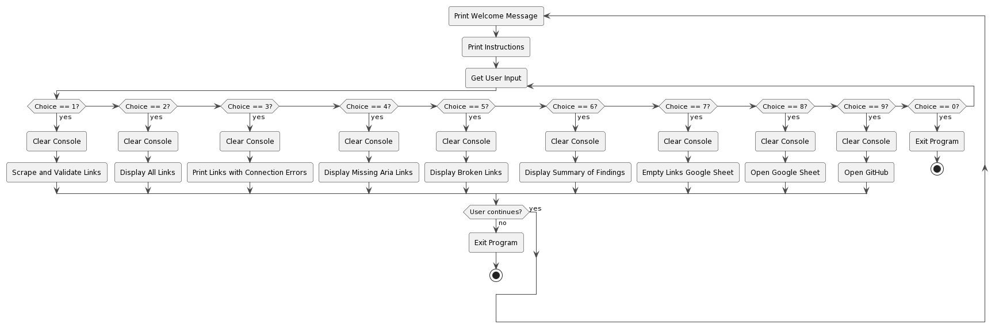

## Features

- The Link-Validator Tool offers a range of features to help users scrape webpages, validate links, and generate reports. Key features include:

### Scraping and Validation

- Scrapes a webpage and validates all links found, checking for broken links, missing Aria labels, and more.
  

### Google Sheets Integration

- Stores link validation results in a Google Sheets document for easy access and sharing.
  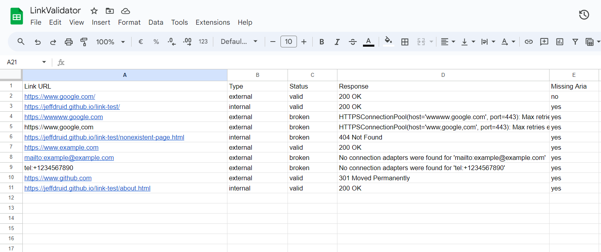

### Interactive Command-Line Interface (CLI)

- Provides a user-friendly CLI with menu options for different operations and displays results in real-time.
  

### Color-Coded Output

- Utilizes color-coded output for easy identification of link status (valid, invalid, etc.).
  

### Error Handling

- Implements robust error handling to handle various scenarios gracefully.

| Error                                                                         | Description                                                                                                                                                                                                                                                 |
| ----------------------------------------------------------------------------- | ----------------------------------------------------------------------------------------------------------------------------------------------------------------------------------------------------------------------------------------------------------- |
| 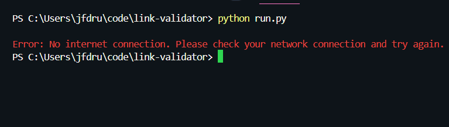                | This error message appears when the program detects no internet connection. It terminates the program without crashing. Without internet access, the tool cannot scrape web pages or validate links.                                                        |
| 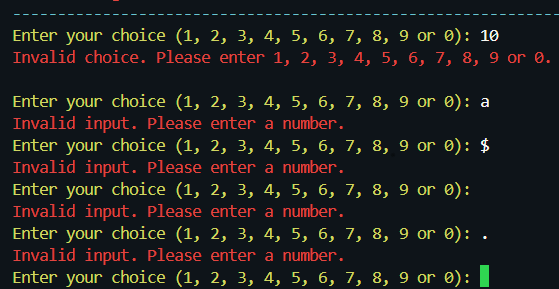                 | This error occurs when the user provides an invalid input, such as a non-numeric character in response to a menu prompt. The program prompts the user to enter a valid numeric choice corresponding to the available menu options.                          |
| 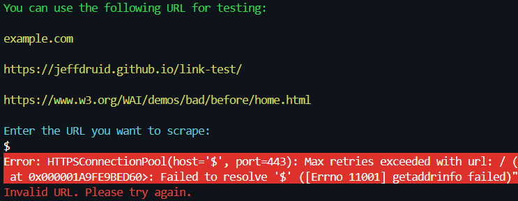 | This error indicates that the URL provided by the user contains invalid characters. The program prompts the user to enter a valid URL for scraping and validation. It also suggests some sample URLs for testing.                                           |
| 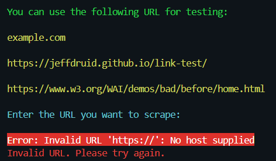                         | This error indicates that the user has provided an invalid URL input. The program prompts the user to enter a valid URL for scraping and validation.                                                                                                        |
| 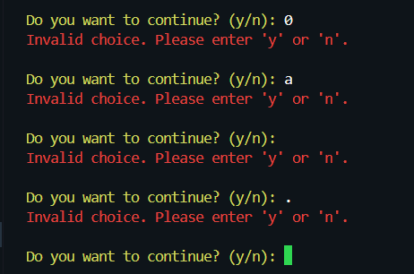               | This error arises when the program encounters an invalid input during the menu prompt. It suggests that the user try again.                                                                                                                                 |
| 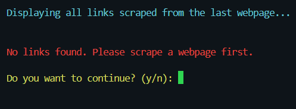                       | This error occurs when attempting to display data, but the data retrieved is empty. It could happen due to various reasons, such as no data being scraped yet or an error in fetching the data. The user is informed that no data is available for display. |

### Progress Indicator

- Displays a progress indicator during the link validation process to indicate the status of the operation.
  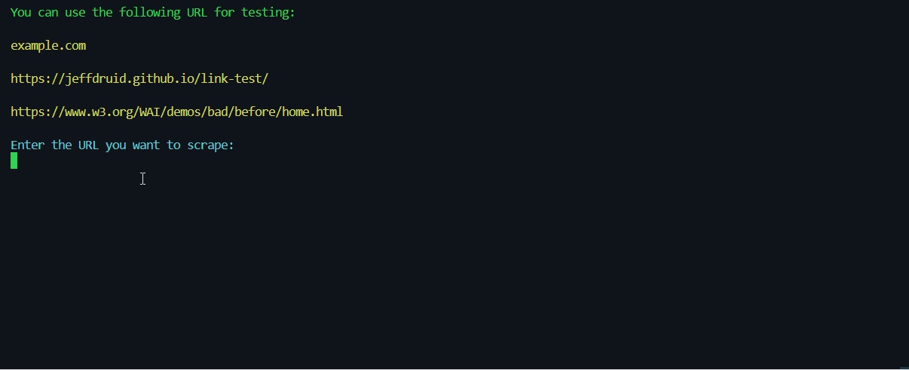

### Reporting

- Generates a comprehensive report summarizing the results of the link validation process, including the number of valid and broken links, links with missing Aria labels, and more.
  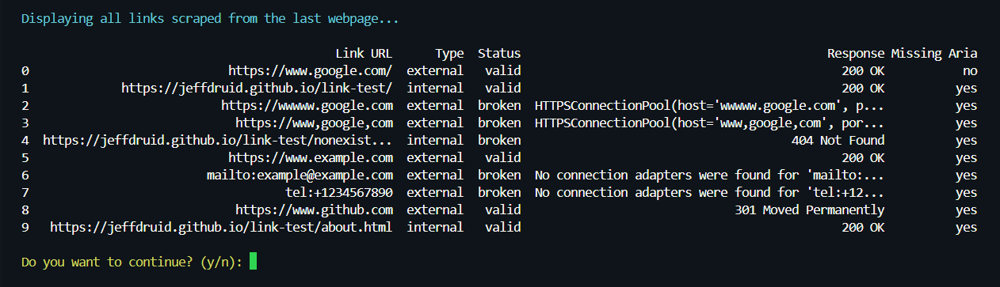

### GitHub Integration

- Provides a direct link to the project's GitHub repository for additional information and contributions.
  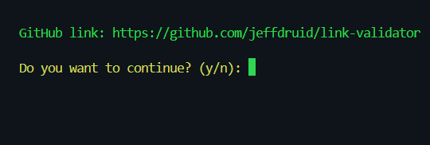

## Troubleshooting

- Encountered issues and how they were resolved during the development of the Link-Validator Tool.

### Handling Redirects

- Issue: The tool was not following redirects properly, leading to inaccurate link status validation. When a URL redirects to another URL, the tool wasn't able to capture the final destination URL and status code.
- Resolution: Updated the HTTP request handling code to automatically follow redirects and obtain the final destination URL and status code.

```python
# Inside the 'scrape_and_validate_links' method
try:
    response = requests.get(url)
    response.raise_for_status()  # Raise an HTTPError if status code is not 200
    soup = BeautifulSoup(response.content, "html.parser")
except requests.exceptions.RequestException as e:
    print(self.RED + f"An error occurred while fetching the webpage: {e}" + self.RESET)
    return
```

- Explanation: The code snippet above uses the requests.get() method to send an HTTP GET request to the URL and automatically follow redirects. The raise_for_status() method is called to raise an HTTPError if the status code of the response is not 200 (OK). This ensures that the tool captures the final destination URL and status code accurately.

### Invalid URL Handling

- Issue: The tool may encounter invalid URLs entered by the user, causing the program to crash.
- Resolution: Implemented URL validation to ensure that only valid URLs are accepted, and added handling for invalid URLs.

```python
# Inside the 'validate_url' method
try:
    response = requests.head(url, allow_redirects=True, stream=True, timeout=5)
    print(self.GREEN + "Status code: " + str(response.status_code) + self.RESET)
    return response.status_code == 200
except requests.exceptions.RequestException as e:
    print(Back.RED + f"Error: {e}" + self.RESET)
    return False
except ValueError as e:
    print(f"Invalid URL: {e}")
    return False
```

- Explanation: The code snippet above uses the requests.head() method to send a HEAD request to the URL and check the status code of the response. If the URL is invalid or the request fails, an exception is caught, and an appropriate error message is displayed.

### Inconsistent Link Status

- Issue: The tool was not consistently determining the status of links, leading to inaccuracies in link validation.
- Resolution: Added logic to check the status code of the HTTP response and classify links as either valid or broken based on the status code.

```python
# Inside the 'check_broken_links' method
if response.status_code >= 400:
    print(f"Broken link found: {link}")
    link_status[link] = ('broken', response.status_code)
else:
    link_status[link] = ('valid', response.status_code)
```

- Explanation: The code snippet above checks the status code of the HTTP response and classifies links as either valid or broken based on the status code. If the status code is greater than or equal to 400, the link is considered broken, and the status code is stored in the link_status dictionary.

## Testing

- The Link-Validator Tool was tested using a combination of manual testing and automated validation methods to ensure its functionality, reliability, and accuracy.

### [Manual Testing](README.md)

- Manual testing was performed to validate the tool's features, user interactions, and error handling mechanisms.
- The Manual Testing can be accessed [here](TESTS.md).

### Validator Testing

- The Link-Validator Tool was tested using the following validation methods:

#### Flake8

- Flake8 was used to check the code for PEP8 compliance and to identify any potential issues or inconsistencies in the codebase.

  ```properties
  flake8 run.py
  ```

  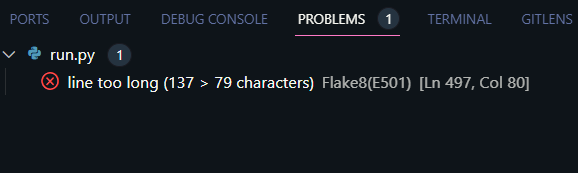

  - The Flake8 tool was used to check the code for PEP8 compliance and identify any potential issues or inconsistencies in the codebase. The output of the Flake8 command provides information about the specific lines of code that need to be addressed to ensure PEP8 compliance.

  - Currently, there are no errors in the codebase, and the tool is PEP8 compliant.
    

#### CI Python Linter

- The CI Python Linter was used to check the code for PEP8 compliance and to identify any potential issues or inconsistencies in the codebase.

  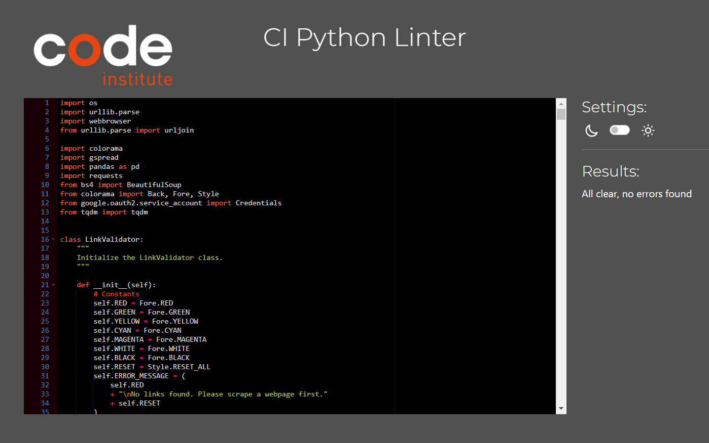

  - The results of the CI Python Linter indicate that the codebase is PEP8 compliant, with no errors detected.

## Bugs

### Google Sheets Not Opening in a New Tab (Deployment Issue)

When the project is deployed on Heroku, users may encounter an issue where Google Sheets fail to open in a new tab when the corresponding option is selected from the Link-Validator Tool. This behavior differs from the expected functionality observed during local deployment, where Google Sheets open in a new tab successfully.

Details:

- **Issue Description:** When users choose to open Google Sheets to view link validation results, the Google Sheets fail to open in a new tab as intended.
- **Observed Behavior:** Clicking the option to open Google Sheets results in the browser attempting to open the Sheets but ultimately failing to do so.
- **Expected Behavior:** Upon selecting the option to open Google Sheets, the Sheets should open in a new browser tab, allowing users to view link validation results seamlessly.

Possible Causes:

- **Deployment Environment:** The discrepancy in behavior between local deployment and Heroku deployment suggests that the issue may be related to the differences in the deployment environments.
- **Browser Configuration:** It's possible that the browser's configuration or security settings on Heroku are affecting the behavior of opening Google Sheets in a new tab.

### GitHub Repository Link Not Opening in a New Tab (Deployment Issue)

When the project is deployed on Heroku, clicking the option to view the GitHub repository does not open GitHub in a new tab as expected. This functionality works correctly in local deployment but fails to open in a new tab on Heroku.

### Fixed Bugs

- Explain the bugs encountered during the development of the Link-Validator Tool and how they were resolved.

#### Trail slash in the URL

- Issue: The tool was not handling URLs with trailing slashes correctly, leading to inaccurate link validation results.

  ```python
    def get_base_url(self, url):
            """
            Extract the base URL from the given URL.
            """
            parsed_url = urllib.parse.urlparse(url)
            # No path (like in "https://example.com/")
            if not parsed_url.path:
                base_url = f"{parsed_url.scheme}://{parsed_url.netloc}/"
            else:
                base_url = (
                    f"{parsed_url.scheme}://{parsed_url.netloc}"
                    f"{parsed_url.path.rstrip('/')}/"
                )
            return base_url
  ```

Explanation:

- The get_base_url() method is responsible for extracting the base URL from a given URL.
- It utilizes the urlparse() function from the urllib.parse module to parse the URL into its components.
- If the URL has no path component (e.g., "https://example.com/"), it appends a trailing slash to the base URL.
- If the URL has a path component, it removes any trailing slashes from the path before constructing the base URL.
- This ensures that the base URL is properly formatted, regardless of whether the input URL has a trailing slash or not.

#### Incorrect Identification of Internal Links

- Issue: The tool was incorrectly saving internal links with the wrong base URL, leading to inaccurate validation results.

  ```python
  def is_internal_link(self, link, base_url):
          """
          Check if a link is internal based on the base URL.
          """
          parsed_link = urllib.parse.urlparse(link)
          parsed_base_url = urllib.parse.urlparse(base_url)
          return parsed_link.netloc == parsed_base_url.netloc
  ```

Explanation:

- The is_internal_link() method is responsible for determining whether a given link is internal or external based on the provided base URL.
- It utilizes the urlparse() function from the urllib.parse module to parse both the link and the base URL into their respective components.
- By comparing the netloc attribute of both parsed URLs, the method checks if the link belongs to the same domain as the base URL.
- If the netloc values match, the link is considered internal, and the method returns True; otherwise, it returns False.
- This ensures that internal links are correctly identified and validated against the correct base URL, improving the accuracy of the link validation process.

#### Incorrect Base URL Extraction

Issue:

- The tool extracted incorrect base URLs when the URL path ended with ".html", resulting in inaccurate link validation.

Description:

- When extracting the base URL from a given URL, the LinkValidator tool encountered a bug specifically related to URLs ending with ".html".
  The bug occurred in the get_base_url() method of the LinkValidator class.

  ```python
  if parsed_url.path.endswith(".html"):
      base_url = (
          f"{parsed_url.scheme}://{parsed_url.netloc}"
          f"{'/'.join(parsed_url.path.split('/')[:-1])}/"
      )
  ```

Explanation:

- This modified code now includes a check to verify if the URL path ends with ".html" before proceeding to extract the base URL.
  If the path ends with ".html", the code removes the last component (the HTML file) from the path to ensure the correct base URL extraction.
  This fix resolves the bug and ensures accurate base URL extraction, especially for URLs ending with ".html".

## UI Improvements

- UI improvements made to enhance the user experience and usability of the Link-Validator Tool.

### Implementation of the colorama Library:

- The colorama library was integrated into the tool to provide colorful output messages. This enhancement makes the output more visually appealing and easier to read for users. Different colors are used to highlight important messages, errors, prompts, and other information, improving the overall user experience.

  

### Removal of ASCII Art:

- Originally, ASCII art was planned to be implemented as part of the UI improvements to add visual interest and enhance the aesthetics of the tool. However, after consideration, it was decided to remove the ASCII art feature. This decision was made for several reasons:

  - **Validator Error:** The ASCII art caused issues with the tool's validation process, leading to errors and inconsistencies in the output.
  - **Focus on Functionality:** The primary focus of the tool is its functionality, specifically link scraping and validation. As such, it was deemed more important to prioritize the development and refinement of core features rather than decorative elements.
  - **Simplicity and Clarity:** Removing ASCII art helps maintain a clean and uncluttered interface, ensuring that users can easily navigate the tool and focus on its essential functionalities without distractions.

### Improved Main Menu:

- The main menu of the tool was enhanced to improve navigation and user interaction. The menu options were organized in a clear and intuitive manner, making it easier for users to understand and access the various functionalities offered by the tool. Additionally, descriptive prompts and instructions were provided to guide users through the menu options and usage of the tool effectively.
  

### Adjusted display all links according to terminal size:

- The display all links feature was adjusted to accommodate different terminal sizes. The output is now formatted to fit the user's terminal width, ensuring that all links are displayed clearly and legibly without wrapping or truncation. This improvement enhances the readability of the link list and provides a better user experience for users with varying terminal sizes.

  ```python
    # Get terminal width
    terminal_width = shutil.get_terminal_size().columns

    # Truncate columns if the DataFrame exceeds terminal width
    pd.set_option("display.max_columns", None)
    pd.set_option("display.width", terminal_width)
  ```

  - This code dynamically sets the maximum display width of the DataFrame based on the current terminal width. It ensures that the DataFrame is displayed within the available space in the terminal, preventing truncation of columns due to limited space.

## Futures Improvements

- **Improved Link Validation Algorithm**: Enhance the link validation algorithm to handle edge cases more effectively and accurately detect various types of broken links.
- **Enhanced User Interface**: Develop a graphical user interface (GUI) using a framework like PyQt or Tkinter to provide a more intuitive and visually appealing experience for users.
- **Parallel Processing**: Implement parallel processing techniques to speed up the link validation process, allowing the tool to handle large websites more efficiently.
- **Customizable Reporting**: Allow users to customize the format and content of the link validation report, including options to export data in different formats (e.g., CSV, PDF).
- **Integration with More External Services**: Integrate with additional external services and APIs to enhance functionality, such as integration with popular CMS platforms or SEO analysis tools.
- **Scheduled Scans**: Add support for scheduled scans or automated monitoring of websites, enabling users to receive regular reports on the status of their links.
- **Browser Extension**: Develop a browser extension that users can install to perform link validation directly within their web browsers, simplifying the validation process.
- **Advanced Configuration Options**: Provide advanced configuration options for users to customize the link validation process, such as specifying timeout values or configuring custom headers for requests.
- **Error Handling Enhancements**: Improve error handling mechanisms to gracefully handle unexpected errors and provide more informative error messages to users.
- **Internationalization (i18n)**: Implement support for multiple languages to make the tool accessible to users from different regions and language preferences.

## Setup

- If you want to deploy the Link-Validator Tool locally for testing or development purposes, follow these steps:

### Prerequisites

Before running the Link-Validator Tool, ensure you have the following installed:

- Python 3.x
- pip package manager
- Google Account (for Google Sheets integration)

### Installation

1. Clone the repository to your local machine:

   ```properties
   git clone https://github.com/yourusername/link-validator.git
   ```

2. Navigate to the project directory:

   ```properties
   cd link-validator
   ```

3. Install the required Python packages:

   ```properties
   pip install -r requirements.txt
   ```

4. Obtain Google Sheets API credentials:
   - Visit the [Google Developers Console](https://console.developers.google.com/).
   - Create a new project.
   - Enable the Google Sheets API for your project.
   - Create service account credentials and download the JSON file.
   - Rename the JSON file to `creds.json` and place it in the project directory.

### Usage

To run the Link-Validator Tool, execute the following command in your terminal:

```properties
python run.py
```

## Deployment

- Deploying the Link-Validator Tool locally or remotely using Heroku.

### Cloning & Forking

- To clone or fork the Link-Validator Tool repository, follow the instructions below:

#### Cloning

- To clone this repository to your local machine, use the following command:

  ```properties
  git clone https://github.com/yourusername/link-validator.git
  ```

#### Forking

1. Visit [Link-Validator Tool](github.com/jeffdruid/link-validator)
2. Click on the "Fork" button located in the top-right corner of the page.
3. Optionally, you can provide a description for your fork.
4. Select "Create fork". You will be redirected to your newly created forked repository.

### Local Deployment

- To deploy this project locally, follow the installation instructions provided in the Setup section.

### Remote Deployment (Heroku)

1. Create a Heroku Account
   If you haven't already, sign up for a free account on [Heroku](https://signup.heroku.com/)

2. Install Heroku CLI
   Download and install the Heroku CLI for your operating system.

3. Login to Heroku
   Open a terminal or command prompt and login to your Heroku account using the following command:

```properties
heroku login
```

Follow the prompts to enter your Heroku credentials.

4. Prepare Your Application
   Ensure your application is ready for deployment to Heroku:

- Make sure your application has a requirements.txt file listing all dependencies.
- Include a Procfile in the root directory of your project. This file specifies the commands that Heroku should use to run your application.
- If your application requires any environment variables, ensure they are properly configured.

5. Initialize Git Repository

- If your project is not already a Git repository, initialize one:

```properties
git init
git add .
git commit -m "Initial commit"
```

6. Create a Heroku App
   Create a new Heroku app using the Heroku CLI:

```properties
heroku create your-app-name
```

Replace your-app-name with a unique name for your Heroku app.

7. Deploy Your Application
   Deploy your application to Heroku using Git:

```properties
git push heroku main
```

Replace main with the name of your main branch if it's different (e.g., master).

8. Open Your Application
   Once the deployment is complete, you can open your application in the browser using the following command:

```properties
heroku open
```

- This will open your application in the default web browser.
- Your Python application should now be deployed and running on Heroku. You can access it using the provided Heroku URL or custom domain if configured.

## Credits

- [Code Institute - Terminal](https://codeinstitute.net/)
- [Heroku - Cloud Application Platform](https://www.heroku.com/)
- [BeautifulSoup Documentation](https://www.crummy.com/software/BeautifulSoup/bs4/doc/)
- [Requests Documentation](https://docs.python-requests.org/en/master/)
- [Google Sheets API Documentation](https://developers.google.com/sheets/api)
- [URLParse Documentation](https://docs.python.org/3/library/urllib.parse.html)
- [pandas Documentation](https://pandas.pydata.org/docs/)
- [tqdm Documentation](https://tqdm.github.io/)
- [Colorama Documentation](https://pypi.org/project/colorama/)
- [os Documentation](https://docs.python.org/3/library/os.html)
- [webbrowser Documentation](https://docs.python.org/3/library/webbrowser.html)
- [Asci Art Generator](https://patorjk.com/software/taag/)
- [Black - The Uncompromising Code Formatter](https://black.readthedocs.io/en/stable/)
- [flake8 - Your Tool For Style Guide Enforcement](https://flake8.pycqa.org/en/latest/)

### Source Code

- [Link-Test Github](https://github.com/jeffdruid/link-test)

#### Images

- [Banner - Canva AI](https://www.canva.com)

#### Useful links

- [Link-Test Page](https://jeffdruid.github.io/link-test/)
- [Web Scraping with Python and BeautifulSoup is THIS easy! - Tom's Tech Academy](https://www.youtube.com/watch?v=nBzrMw8hkmY)
- [The Best Websites to Practice Your Web Scraping Skills in 2024 - Proxyway](https://proxyway.com/guides/best-websites-to-practice-your-web-scraping-skills)
- [Web Scraping with Python and BeautifulSoup - Real Python](https://realpython.com/beautiful-soup-web-scraper-python/)
- [Web Scraping with Python: A Beginner's Guide - DataCamp](https://www.datacamp.com/community/tutorials/web-scraping-using-python)
- [freeCodeCamp.org - Web Scraping with Python](https://www.freecodecamp.org/news/web-scraping-python-tutorial-how-to-scrape-data-from-a-website/)
- [Learn python - Full Course for Beginners - freeCodeCamp.org](https://www.youtube.com/watch?v=rfscVS0vtbw)
- [Stack Overflow - Max line length in Python](https://stackoverflow.com/questions/39973318/what-is-the-maximum-length-of-a-line-in-python)
- [Stack Overflow - error with webbrowser module while deploying my app on heroku](https://stackoverflow.com/questions/62821072/error-with-webbrowser-module-while-deploying-my-app-on-heroku)

## License

- The Link-Validator Tool is licensed under the MIT License.
